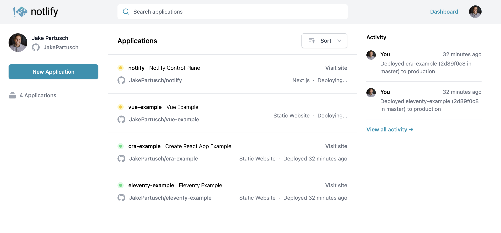

<p align="center">
    
</p>
<h1 align="center">
  Notlify
</h1>

<h3 align="center">
  💻 🚀 ☁ 
</h3>
<h3 align="center">
  A Netlify-like PaaS on AWS
</h3>
<p align="center">
  Notlify is a Platform as a Service example that mimics the functionality of Netlify, using AWS Serverless techonologies
</p>

### What is Notlify?

Notlify is primarily an example of building a Platform as a Service with AWS technologies.

- **Static Websites** Websites with static assets are all supported. They are continuously deployed on commit to an S3 bucket with a CloudFront distribution.
- **Custom GitHub Action** Notlify applications are simply deployed with a custom GitHub Action

```yaml
- name: Deploy UI
  uses: JakePartusch/notlify-action@main
  with:
    applicationName: vue-example
    distributionDirectory: dist
    apiKey: ${{ secrets.NOTLIFY_API_KEY }}
```

- **Administrative UI** Notlify ships a Control Plane UI at https://notlify.dev.
<p align="center">
    
</p>

- **Serverless GraphQL Admin API** The Notlify UI is backed by an Apollo GraphQL server in a Lambda function, using DynamoDB as a data store.
- **Website Deployments via GitHub Actions** Notlify executes individual website deployments to a separate AWS Account, using a distinct stage in the user's chosen region. 
